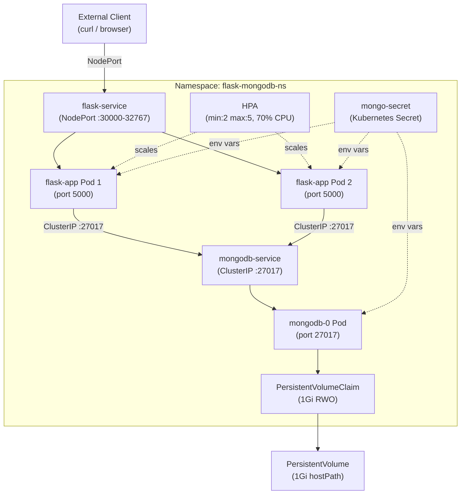

# Design Document — flask-mongodb-k8s

## Overview

This document describes the technical design for a production-ready Python Flask web application backed by MongoDB, containerized with Docker, and deployed on Kubernetes (Minikube). The system exposes a REST API with three endpoints, uses Kubernetes-native patterns for secrets management, persistent storage, and horizontal autoscaling, and is fully documented with a comprehensive README.

The design covers:
- Application architecture and component relationships
- Flask application code structure and error handling
- Docker image design
- Kubernetes resource design (Namespace, Secret, PV/PVC, StatefulSet, Deployment, Services, HPA)
- Correctness properties and testing strategy

### Design Goals

1. **Security**: MongoDB credentials stored only in Kubernetes Secrets; Flask container runs as non-root.
2. **Durability**: MongoDB data persisted via PersistentVolume survives Pod restarts.
3. **Scalability**: Flask tier scales horizontally via HPA based on CPU utilization.
4. **Observability**: Structured logging throughout the Flask application.
5. **Minikube compatibility**: All Kubernetes primitives chosen for local single-node operation.

---

## Architecture

### Component Diagram



### Request Flow

1. External client sends HTTP request to Minikube node IP on the NodePort assigned to `flask-service`.
2. `flask-service` load-balances across available `flask-app` Pods.
3. The Flask Pod handles the request; for `/data` endpoints it connects to `mongodb-service` (ClusterIP DNS).
4. `mongodb-service` routes to the single `mongodb-0` StatefulSet Pod.
5. MongoDB authenticates the connection using credentials from `mongo-secret`.
6. MongoDB reads/writes to `/data/db` which is mounted from the PVC → PV (hostPath on Minikube node).

### Resource Manifest Application Order

Resources must be applied in dependency order:

```
1. k8s/namespace.yaml
2. k8s/mongo-secret.yaml
3. k8s/pv.yaml
4. k8s/pvc.yaml
5. k8s/mongodb-statefulset.yaml
6. k8s/mongodb-service.yaml
7. k8s/flask-deployment.yaml
8. k8s/flask-service.yaml
9. k8s/hpa.yaml
```

---

## Components and Interfaces

### Flask Application (`app.py`)

**Responsibilities**: Handle HTTP requests, validate input, communicate with MongoDB, return structured responses.

**Endpoints**:

| Method | Path   | Request                        | Response (success)                          | Response (error)          |
|--------|--------|--------------------------------|---------------------------------------------|---------------------------|
| GET    | `/`    | —                              | 200, text with welcome + timestamp          | 503 if MongoDB unreachable |
| GET    | `/data`| —                              | 200, JSON array of all records              | 503 if MongoDB unreachable |
| POST   | `/data`| JSON body (any valid object)   | 201, `{"status": "Data inserted"}`          | 400 bad JSON, 503 no MongoDB |

**Environment Variables**:

| Variable         | Source              | Used For                     |
|------------------|---------------------|------------------------------|
| `MONGO_USERNAME` | `mongo-secret`      | MongoDB auth username        |
| `MONGO_PASSWORD` | `mongo-secret`      | MongoDB auth password        |
| `MONGO_HOST`     | Deployment manifest | MongoDB hostname (default: `mongodb-service`) |

**Connection String Construction**:
```
mongodb://{MONGO_USERNAME}:{MONGO_PASSWORD}@{MONGO_HOST}:27017/
```

**Module Structure** (`app.py`):
- Module-level: logging configuration, Flask app creation, MongoDB client initialization
- `get_db()`: returns the MongoDB collection, raises on connection failure
- `index()`: handles GET `/`
- `get_data()`: handles GET `/data`
- `post_data()`: handles POST `/data`
- `handle_exception(e)`: global unhandled exception handler (500)
- `if __name__ == '__main__'`: runs on `0.0.0.0:5000`

### `requirements.txt`

Pinned direct dependencies:
```
Flask==3.0.3
pymongo==4.7.2
python-dotenv==1.0.1
```

### Dockerfile

Build stages:
1. Base: `python:3.10-slim`
2. Create non-root user `appuser` (uid 1000)
3. Set working directory `/app`
4. Copy and install `requirements.txt` (separate layer for cache efficiency)
5. Copy `app.py`
6. `EXPOSE 5000`
7. Switch to `appuser`
8. `CMD ["python", "app.py"]`

### Kubernetes Resources

#### Namespace (`k8s/namespace.yaml`)
- Name: `flask-mongodb-ns`
- Labels: `project: flask-mongodb-k8s`, `env: demo`

#### Secret (`k8s/mongo-secret.yaml`)
- Name: `mongo-secret`, namespace: `flask-mongodb-ns`
- Type: `Opaque`
- Keys: `mongo-username` (base64 of `admin`), `mongo-password` (base64 of `password`)

#### PersistentVolume (`k8s/pv.yaml`)
- Name: `mongodb-pv`
- Capacity: `1Gi`
- Access mode: `ReadWriteOnce`
- Reclaim policy: `Retain`
- Storage class: `manual`
- Host path: `/mnt/data/mongodb` (Minikube node path)

#### PersistentVolumeClaim (`k8s/pvc.yaml`)
- Name: `mongodb-pvc`, namespace: `flask-mongodb-ns`
- Requests: `1Gi`, `ReadWriteOnce`
- Storage class: `manual`

#### MongoDB StatefulSet (`k8s/mongodb-statefulset.yaml`)
- Name: `mongodb`, namespace: `flask-mongodb-ns`
- Replicas: 1
- Image: `mongo:latest`
- Port: 27017
- Environment variables from `mongo-secret`: `MONGO_INITDB_ROOT_USERNAME`, `MONGO_INITDB_ROOT_PASSWORD`
- Volume mount: `mongodb-pvc` → `/data/db`
- Resources: requests `cpu:200m, memory:256Mi`; limits `cpu:500m, memory:512Mi`
- Readiness probe: TCP socket on port 27017, `initialDelaySeconds:10`, `periodSeconds:5`

#### MongoDB Service (`k8s/mongodb-service.yaml`)
- Name: `mongodb-service`, namespace: `flask-mongodb-ns`
- Type: `ClusterIP`
- Port: 27017 → 27017
- Selector: `app: mongodb`

#### Flask Deployment (`k8s/flask-deployment.yaml`)
- Name: `flask-app`, namespace: `flask-mongodb-ns`
- Replicas: 2
- Image: `yourdockerhub/flask-app:v1`
- Port: 5000
- Environment variables from `mongo-secret`: `MONGO_USERNAME`, `MONGO_PASSWORD`; `MONGO_HOST: mongodb-service` (literal)
- Resources: requests `cpu:200m, memory:256Mi`; limits `cpu:500m, memory:512Mi`
- Readiness probe: HTTP GET `/`, port 5000, `initialDelaySeconds:5`, `periodSeconds:10`
- Liveness probe: HTTP GET `/`, port 5000, `initialDelaySeconds:15`, `periodSeconds:20`

#### Flask Service (`k8s/flask-service.yaml`)
- Name: `flask-service`, namespace: `flask-mongodb-ns`
- Type: `NodePort`
- Port: 80 → targetPort 5000
- Selector: `app: flask-app`

#### HPA (`k8s/hpa.yaml`)
- Name: `flask-hpa`, namespace: `flask-mongodb-ns`
- API version: `autoscaling/v2`
- Scale target: `flask-app` Deployment
- Min replicas: 2, max replicas: 5
- Metric: CPU utilization, average utilization 70%

---

## Data Models

### Record (MongoDB Document)

The Flask application accepts any valid JSON object as a Record and stores it verbatim in MongoDB. No schema enforcement is applied at the application layer — MongoDB's document model handles arbitrary structures.

```python
# Conceptual representation
Record = dict  # Any valid JSON object

# Stored in collection: flask_db.records
# MongoDB adds _id (ObjectId) automatically
```

**Serialization note**: When returning records from GET `/data`, the MongoDB `_id` field (ObjectId) must be converted to a string before JSON serialization, since `ObjectId` is not JSON-serializable by default.

```python
def serialize_record(doc: dict) -> dict:
    doc["_id"] = str(doc["_id"])
    return doc
```

### API Response Shapes

**GET `/`**
```json
"Welcome to the Flask app! The current time is: 2024-01-15 10:30:45.123456"
```

**GET `/data`**
```json
[
  {"_id": "507f1f77bcf86cd799439011", "name": "Alice", "age": 30},
  {"_id": "507f1f77bcf86cd799439012", "key": "value"}
]
```

**POST `/data` (success)**
```json
{"status": "Data inserted"}
```

**Error responses**
```json
{"error": "Invalid JSON body"}        // 400
{"error": "Database unavailable"}     // 503
{"error": "Internal server error"}    // 500
```

### Kubernetes Secret Data

| Key              | Plaintext Value | Base64 Encoded |
|------------------|-----------------|----------------|
| `mongo-username` | `admin`         | `YWRtaW4=`     |
| `mongo-password` | `password`      | `cGFzc3dvcmQ=` |

---

## Correctness Properties

*A property is a characteristic or behavior that should hold true across all valid executions of a system — essentially, a formal statement about what the system should do. Properties serve as the bridge between human-readable specifications and machine-verifiable correctness guarantees.*

The following properties are derived from the acceptance criteria in the requirements document. They apply to the Flask application logic and are suitable for property-based testing. Kubernetes infrastructure requirements (manifests, StatefulSet behavior, DNS) are validated through smoke/integration tests rather than property-based tests, as their behavior does not vary meaningfully with input and involves external systems.

### Property 1: POST/GET data round-trip

*For any* valid JSON object posted to `/data`, a subsequent GET to `/data` SHALL return a JSON array that contains a record with the same key-value pairs as the posted object.

**Validates: Requirements 1.2, 1.3**

### Property 2: Invalid JSON body rejected

*For any* HTTP POST to `/data` whose body is not a valid JSON object (empty body, non-JSON string, JSON array at root level, wrong Content-Type), the Flask_App SHALL return an HTTP 400 response and the database record count SHALL remain unchanged.

**Validates: Requirements 1.4**

### Property 3: Connection string construction

*For any* non-empty username, password, and host string provided as environment variables, the Flask_App SHALL construct the MongoDB connection string in the form `mongodb://{username}:{password}@{host}:27017/` with no characters omitted or reordered.

**Validates: Requirements 2.3**

### Property 4: Unhandled exceptions produce safe 500 responses

*For any* exception type raised during request processing, the Flask_App SHALL return an HTTP 500 response with a body that does not contain the exception's internal message or traceback, while the full traceback IS recorded in the application log.

**Validates: Requirements 3.4**

---

## Error Handling

### Application-Level Error Handling

| Condition | Behavior | HTTP Status | Log Level |
|-----------|----------|-------------|-----------|
| Valid request, DB available | Normal response | 200/201 | INFO |
| Invalid/missing JSON body | Return error message | 400 | WARNING |
| MongoDB connection failure | Return "Database unavailable" | 503 | ERROR |
| MongoDB auth failure at startup | Log and exit | — | CRITICAL |
| Unhandled exception in handler | Return "Internal server error" (no stack trace in body) | 500 | ERROR (full traceback) |

### Flask Global Error Handler

A `@app.errorhandler(Exception)` decorator catches all unhandled exceptions, logs the full traceback using `logging.exception()`, and returns a generic 500 response. This prevents leaking internal details to clients.

```python
@app.errorhandler(Exception)
def handle_exception(e):
    logging.exception("Unhandled exception: %s", str(e))
    return jsonify({"error": "Internal server error"}), 500
```

### MongoDB Connection Error Handling

Each request handler that accesses MongoDB wraps the DB call in a `try/except` block catching `pymongo.errors.ConnectionFailure` and `pymongo.errors.OperationFailure`:

```python
try:
    result = collection.find({})
    ...
except (ConnectionFailure, OperationFailure) as e:
    logging.error("Database error: %s", str(e))
    return jsonify({"error": "Database unavailable"}), 503
```

### Startup Authentication Check

On startup, the application performs a `client.admin.command('ping')` after constructing the MongoClient. If this raises, the error is logged at CRITICAL level and the process exits with code 1.

### Kubernetes-Level Error Handling

| Scenario | Kubernetes Response |
|----------|---------------------|
| Flask Pod crash | Deployment controller restarts Pod; readiness probe gates traffic |
| MongoDB Pod restart | StatefulSet reattaches PVC; Flask retries on next request |
| Liveness probe failure | kubelet restarts the Flask container |
| PVC Pending | MongoDB Pod stuck in Pending; check PV availability |
| HPA `<unknown>` metrics | Metrics server addon not enabled; run `minikube addons enable metrics-server` |

---

## Testing Strategy

### Overview

The testing strategy uses a dual approach:
- **Unit/property tests** for Flask application logic (pure functions, request handlers with mocked MongoDB)
- **Smoke tests** for Kubernetes manifest structure validation (YAML content checks)
- **Integration tests** for end-to-end cluster behavior (manual or CI with Minikube)

### Property-Based Testing

The feature has clear candidates for property-based testing in the Flask application layer. The chosen library is **Hypothesis** (Python), the standard PBT library for Python.

**Configuration**:
- Minimum 100 iterations per property (via `@settings(max_examples=100)`)
- Each property test references its design document property in a comment
- Tests use Flask's test client with `mongomock` or `unittest.mock` to avoid real MongoDB connections

**Property Test 1: POST/GET round-trip**
```python
# Feature: flask-mongodb-k8s, Property 1: POST/GET data round-trip
@given(st.dictionaries(st.text(min_size=1), st.text() | st.integers()))
@settings(max_examples=100)
def test_post_get_roundtrip(record):
    # POST record, then GET /data, verify record present
    ...
```

**Property Test 2: Invalid JSON rejected**
```python
# Feature: flask-mongodb-k8s, Property 2: Invalid JSON body rejected
@given(st.one_of(st.just(""), st.binary(), st.text().filter(lambda s: not is_valid_json_object(s))))
@settings(max_examples=100)
def test_invalid_json_rejected(body):
    # POST invalid body, verify 400, verify DB count unchanged
    ...
```

**Property Test 3: Connection string construction**
```python
# Feature: flask-mongodb-k8s, Property 3: Connection string construction
@given(st.text(min_size=1), st.text(min_size=1), st.text(min_size=1))
@settings(max_examples=100)
def test_connection_string(username, password, host):
    expected = f"mongodb://{username}:{password}@{host}:27017/"
    assert build_connection_string(username, password, host) == expected
```

**Property Test 4: Unhandled exceptions produce safe 500**
```python
# Feature: flask-mongodb-k8s, Property 4: Unhandled exceptions produce safe 500 responses
@given(st.text(min_size=1))
@settings(max_examples=100)
def test_unhandled_exception_500(exception_message):
    # Inject an exception with the given message; verify response body
    # does not contain the message; verify log does contain it
    ...
```

### Unit Tests

| Test | Covers |
|------|--------|
| GET `/` returns 200 with welcome string | Requirement 1.1 |
| GET `/data` with empty DB returns `[]` | Requirement 1.2 (edge case) |
| POST `/data` returns 201 with correct body | Requirement 1.3 |
| POST `/data` with empty body returns 400 | Requirement 1.4 |
| All endpoints return 503 when MongoDB unreachable | Requirement 1.5 |
| Auth failure at startup logs CRITICAL and exits 1 | Requirement 2.4 |
| `.env` file loaded when present | Requirement 3.5 |
| Fallback to system env vars when `.env` absent | Requirement 3.5 |
| `_id` ObjectId serialized to string in GET response | Data model correctness |

### Smoke Tests (Manifest Validation)

Using `pyyaml` or `pytest` to load and assert manifest content:

| Manifest | Checks |
|----------|--------|
| `namespace.yaml` | name, labels |
| `mongo-secret.yaml` | type Opaque, correct base64 keys |
| `pv.yaml` | capacity 1Gi, hostPath, accessModes |
| `pvc.yaml` | 1Gi request, storageClassName matches PV |
| `mongodb-statefulset.yaml` | image, resource limits, readiness probe, env var refs |
| `flask-deployment.yaml` | replicas 2, resource limits, readiness + liveness probes, secretKeyRef |
| `flask-service.yaml` | type NodePort, targetPort 5000 |
| `mongodb-service.yaml` | type ClusterIP, port 27017 |
| `hpa.yaml` | apiVersion autoscaling/v2, min 2 max 5, 70% CPU |

### Integration Tests (Minikube)

Manual or CI-driven steps:
1. `minikube start && minikube addons enable metrics-server`
2. Apply manifests in order
3. `kubectl wait --for=condition=ready pod -l app=flask-app -n flask-mongodb-ns`
4. `curl` all three endpoints and verify responses
5. Verify DNS: `kubectl exec -it <flask-pod> -- curl mongodb-service:27017`
6. Load test to trigger HPA scaling
7. Delete MongoDB pod; verify data persists after rescheduling

### Test File Structure

```
tests/
  unit/
    test_endpoints.py        # Unit tests for all three endpoints
    test_connection_string.py
    test_error_handling.py
  property/
    test_data_roundtrip.py   # Property 1 & 2
    test_connection_string.py # Property 3
    test_exception_handling.py # Property 4
  smoke/
    test_manifests.py        # YAML manifest validation
```
