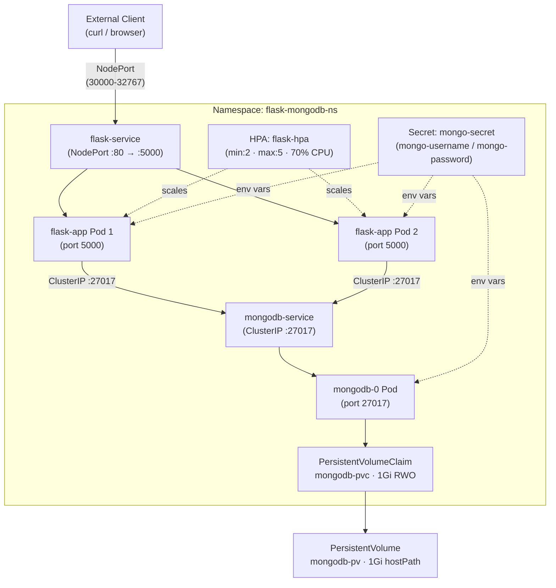

# Flask + MongoDB on Kubernetes (Minikube)

A production-ready Python Flask REST API backed by MongoDB, containerized with Docker, and deployed on Kubernetes using Minikube. Includes Horizontal Pod Autoscaling, persistent storage, and namespace isolation.

---

## Table of Contents

1. [Architecture](#architecture)
2. [Project Structure](#project-structure)
3. [Prerequisites](#prerequisites)
4. [Build and Push Docker Image](#build-and-push-docker-image)
5. [Deploy to Kubernetes](#deploy-to-kubernetes)
6. [Verify the Deployment](#verify-the-deployment)
7. [Test the API Endpoints](#test-the-api-endpoints)
8. [Connect to MongoDB from Inside the Cluster](#connect-to-mongodb-from-inside-the-cluster)
9. [Test DNS Resolution](#test-dns-resolution)
10. [HPA Scaling](#hpa-scaling)
11. [View Logs](#view-logs)
12. [Troubleshooting](#troubleshooting)
13. [Cleanup](#cleanup)
14. [Design Decisions](#design-decisions)

---

## Architecture

### Component Diagram



### Request Flow

1. **External client → NodePort**: An HTTP request arrives at the Minikube node IP on the NodePort assigned to `flask-service` (range 30000–32767).
2. **NodePort → flask-service**: Kubernetes routes the packet to the `flask-service` Service object, which load-balances across all healthy `flask-app` Pods.
3. **flask-service → flask-app Pod**: One of the Flask Pods (running on port 5000) receives the request and processes it.
4. **flask-app Pod → mongodb-service (ClusterIP)**: For `/data` endpoints the Flask Pod resolves the DNS name `mongodb-service` to a stable ClusterIP and opens a TCP connection on port 27017.
5. **mongodb-service → mongodb-0 Pod**: The ClusterIP Service forwards the connection to the single `mongodb-0` StatefulSet Pod.
6. **mongodb-0 Pod → PVC**: MongoDB reads from and writes to `/data/db` inside the container, which is mounted from the `mongodb-pvc` PersistentVolumeClaim.
7. **PVC → PV (hostPath)**: The PVC is bound to `mongodb-pv`, a PersistentVolume backed by `/mnt/data/mongodb` on the Minikube host node, providing durable on-disk storage.

---

## Project Structure

```
flask-mongodb-k8s/
│
├── app.py                        # Flask application — all three API endpoints
├── requirements.txt              # Pinned Python dependencies (Flask, pymongo, python-dotenv)
├── Dockerfile                    # Multi-step Docker image build for the Flask app
├── README.md                     # This file
│
├── k8s/                          # Kubernetes manifests (apply in order shown below)
│   ├── namespace.yaml            # Namespace: flask-mongodb-ns
│   ├── mongo-secret.yaml         # Opaque Secret with base64 MongoDB credentials
│   ├── pv.yaml                   # PersistentVolume (1Gi hostPath, storageClass: manual)
│   ├── pvc.yaml                  # PersistentVolumeClaim bound to mongodb-pv
│   ├── mongodb-statefulset.yaml  # StatefulSet for MongoDB with resource limits and readiness probe
│   ├── mongodb-service.yaml      # ClusterIP Service exposing MongoDB on port 27017
│   ├── flask-deployment.yaml     # Deployment for Flask (2 replicas, liveness + readiness probes)
│   ├── flask-service.yaml        # NodePort Service exposing Flask externally on port 80→5000
│   └── hpa.yaml                  # HorizontalPodAutoscaler (min:2, max:5, 70% CPU)
│
└── tests/
    ├── unit/
    │   ├── conftest.py           # Pytest fixtures for unit tests (mock MongoClient)
    │   ├── test_endpoints.py     # Unit tests for GET /, GET /data, POST /data
    │   └── test_error_handling.py# Unit tests for 500 handler and startup auth failure
    ├── property/
    │   ├── conftest.py           # Fixtures shared across property tests
    │   ├── test_data_roundtrip.py# Property tests: POST/GET round-trip, invalid JSON rejection
    │   ├── test_connection_string.py # Property test: connection string construction
    │   └── test_exception_handling.py# Property test: unhandled exceptions produce safe 500
    └── smoke/
        └── test_manifests.py     # YAML smoke tests validating all 9 K8s manifest files
```

---

## Prerequisites

| Tool       | Minimum Version | Notes                                                         |
|------------|-----------------|---------------------------------------------------------------|
| Docker     | 24.0            | Required to build and push the Flask container image          |
| Minikube   | 1.33            | Local Kubernetes cluster; used for all deployment steps       |
| kubectl    | 1.30            | Kubernetes CLI for applying manifests and inspecting resources|
| Python     | 3.10            | Required only if running tests locally outside the container  |

Verify your installed versions:

```bash
docker --version
minikube version
kubectl version --client
python --version
```

---

## Build and Push Docker Image

### 1. Build the image

Run the following from the project root (the directory containing `Dockerfile`):

```bash
docker build -t yourdockerhub/flask-app:v1 .
```

The `Dockerfile` is structured so that the dependency installation layer (`pip install`) is cached separately from the application source. Rebuilds triggered only by `app.py` changes will reuse the cached dependency layer and complete much faster.

### 2. Log in to Docker Hub (or your registry)

```bash
docker login
```

For a private registry replace `docker login` with:

```bash
docker login registry.example.com
```

### 3. Push the image

```bash
docker push yourdockerhub/flask-app:v1
```

> **Note**: Update the `image:` field in `k8s/flask-deployment.yaml` if you use a different registry path or tag.

### 4. (Optional) Use Minikube's built-in Docker daemon

To avoid pushing to a remote registry during local development, point your shell at Minikube's Docker daemon and build directly into it:

```bash
eval $(minikube docker-env)      # Linux/macOS
# or on Windows PowerShell:
# minikube docker-env | Invoke-Expression

docker build -t yourdockerhub/flask-app:v1 .
```

Then set `imagePullPolicy: Never` in `k8s/flask-deployment.yaml` so Kubernetes uses the local image.

---

## Deploy to Kubernetes

### 1. Start Minikube

```bash
minikube start
```

### 2. Enable the metrics-server addon

The HPA requires the metrics-server to read CPU utilization from Pods. Enable it now — the HPA will show `<unknown>` metrics if this step is skipped.

```bash
minikube addons enable metrics-server
```

Confirm it is running:

```bash
kubectl get deployment metrics-server -n kube-system
```

### 3. Apply all manifests in dependency order

Manifests must be applied in the order below so that dependent resources (e.g., Namespace before all others, PV before PVC) exist before they are referenced.

```bash
kubectl apply -f k8s/namespace.yaml
kubectl apply -f k8s/mongo-secret.yaml
kubectl apply -f k8s/pv.yaml
kubectl apply -f k8s/pvc.yaml
kubectl apply -f k8s/mongodb-statefulset.yaml
kubectl apply -f k8s/mongodb-service.yaml
kubectl apply -f k8s/flask-deployment.yaml
kubectl apply -f k8s/flask-service.yaml
kubectl apply -f k8s/hpa.yaml
```

Or apply them all at once (kubectl resolves dependencies automatically for this set):

```bash
kubectl apply -f k8s/
```

> **Recommended**: use the explicit ordered commands above on first deploy to catch errors per-resource.

### 4. Wait for Pods to become ready

```bash
kubectl wait --for=condition=ready pod \
  -l app=mongodb \
  -n flask-mongodb-ns \
  --timeout=120s

kubectl wait --for=condition=ready pod \
  -l app=flask-app \
  -n flask-mongodb-ns \
  --timeout=120s
```

---

## Verify the Deployment

### Pods

```bash
kubectl get pods -n flask-mongodb-ns
```

Expected output (both Flask Pods and the MongoDB Pod in `Running` state):

```
NAME                         READY   STATUS    RESTARTS   AGE
flask-app-6d8f7b9c4d-abcd    1/1     Running   0          2m
flask-app-6d8f7b9c4d-efgh    1/1     Running   0          2m
mongodb-0                    1/1     Running   0          3m
```

### Services

```bash
kubectl get services -n flask-mongodb-ns
```

Expected output:

```
NAME               TYPE        CLUSTER-IP      EXTERNAL-IP   PORT(S)        AGE
flask-service      NodePort    10.96.100.5     <none>        80:31234/TCP   2m
mongodb-service    ClusterIP   10.96.200.10    <none>        27017/TCP      3m
```

### PersistentVolume and PersistentVolumeClaim

```bash
kubectl get pv mongodb-pv
kubectl get pvc mongodb-pvc -n flask-mongodb-ns
```

Both should show `Bound` status:

```
NAME         CAPACITY   ACCESS MODES   RECLAIM POLICY   STATUS   CLAIM
mongodb-pv   1Gi        RWO            Retain           Bound    flask-mongodb-ns/mongodb-pvc

NAME           STATUS   VOLUME       CAPACITY   ACCESS MODES   STORAGECLASS
mongodb-pvc    Bound    mongodb-pv   1Gi        RWO            manual
```

### HPA

```bash
kubectl get hpa flask-hpa -n flask-mongodb-ns
```

Expected output (after metrics-server is running and Pods have been up for ~1 minute):

```
NAME        REFERENCE             TARGETS   MINPODS   MAXPODS   REPLICAS   AGE
flask-hpa   Deployment/flask-app  5%/70%    2         5         2          2m
```

## Deployment Validation Screenshots

### Successful Deployment
The application was successfully deployed on a live Minikube Kubernetes cluster using the Docker driver.

The following screenshot shows:

- Flask Deployment successfully rolled out
- Two Flask application replicas running
- MongoDB StatefulSet pod running
- All pods healthy with no restarts

![Successful Deployment]

### Services Verification
The following screenshot verifies Kubernetes Services:

- `flask-service` exposed via NodePort
- `mongodb-service` exposed internally via ClusterIP


### Horizontal Pod Autoscaler
The following screenshot verifies that the Horizontal Pod Autoscaler was successfully created and configured:

- Minimum replicas: 2
- Maximum replicas: 5
- Target CPU utilization: 70%


### Persistent Storage Verification
The following screenshot confirms that the PersistentVolumeClaim was successfully bound to the PersistentVolume and MongoDB persistent storage is available.


### Deployment Result Summary

| Component | Status |
|-----------|--------|
| Flask Deployment | Running |
| Flask Pods | 2/2 Running |
| MongoDB StatefulSet | Running |
| MongoDB Service | Running |
| Flask Service | Running |
| Persistent Volume | Bound |
| Persistent Volume Claim | Bound |
| HPA | Configured |
| Namespace Isolation | Active |

The deployment was successfully validated on a live Minikube cluster.

## Test the API Endpoints

### Get the Flask service URL

```bash
FLASK_URL=$(minikube service flask-service -n flask-mongodb-ns --url)
echo $FLASK_URL
# e.g. http://192.168.49.2:31234
```

### GET `/` — Welcome message

```bash
curl $FLASK_URL/
```

Expected response:

```
Welcome to the Flask app! The current time is: 2024-06-01 12:00:00.123456
```

### GET `/data` — Retrieve all records

```bash
curl $FLASK_URL/data
```

Expected response (empty database):

```json
[]
```

### POST `/data` — Insert a record

```bash
curl -X POST $FLASK_URL/data \
  -H "Content-Type: application/json" \
  -d '{"name": "Alice", "role": "engineer"}'
```

Expected response:

```json
{"status": "Data inserted"}
```

Confirm the record was stored:

```bash
curl $FLASK_URL/data
```

Expected response:

```json
[{"_id": "507f1f77bcf86cd799439011", "name": "Alice", "role": "engineer"}]
```

### POST `/data` — Invalid body (expect 400)

```bash
curl -X POST $FLASK_URL/data \
  -H "Content-Type: application/json" \
  -d 'not-json'
```

Expected response:

```json
{"error": "Invalid JSON body"}
```

---

## Connect to MongoDB from Inside the Cluster

Use `kubectl exec` to open a MongoDB shell inside the `mongodb-0` Pod:

```bash
kubectl exec -it mongodb-0 -n flask-mongodb-ns -- \
  mongosh -u admin -p password --authenticationDatabase admin
```

Inside the MongoDB shell, inspect stored records:

```javascript
use flask_db
db.records.find().pretty()
```

Expected output after inserting a record via the API:

```json
[
  {
    "_id": ObjectId("507f1f77bcf86cd799439011"),
    "name": "Alice",
    "role": "engineer"
  }
]
```

To count records:

```javascript
db.records.countDocuments()
```

Exit the shell:

```javascript
exit
```

---

## Test DNS Resolution

Kubernetes DNS automatically creates an `A` record for every Service. To verify that Flask Pods can resolve `mongodb-service`, exec into a running Flask Pod:

```bash
# Get the name of a Flask Pod
FLASK_POD=$(kubectl get pod -l app=flask-app -n flask-mongodb-ns \
  -o jsonpath='{.items[0].metadata.name}')

# Exec into the Pod and test DNS resolution
kubectl exec -it $FLASK_POD -n flask-mongodb-ns -- \
  python -c "import socket; print(socket.gethostbyname('mongodb-service'))"
```

Expected output — the ClusterIP assigned to `mongodb-service`:

```
10.96.200.10
```

You can also test TCP connectivity to port 27017:

```bash
kubectl exec -it $FLASK_POD -n flask-mongodb-ns -- \
  python -c "import socket; s=socket.create_connection(('mongodb-service', 27017), timeout=3); print('OK'); s.close()"
```

---

## HPA Scaling

The HPA watches average CPU utilization across `flask-app` Pods and scales between 2 and 5 replicas when utilization crosses 70%.

### Trigger load to cause scale-up

Open a second terminal and run a load loop against the Flask service:

```bash
FLASK_URL=$(minikube service flask-service -n flask-mongodb-ns --url)

# Send continuous requests for 60 seconds
for i in $(seq 1 500); do
  curl -s $FLASK_URL/ > /dev/null &
done
```

### Watch HPA react

In your first terminal, watch the HPA status update in real time:

```bash
kubectl get hpa flask-hpa -n flask-mongodb-ns --watch
```

You should see `TARGETS` rise above 70% and `REPLICAS` increase toward the maximum of 5:

```
NAME        REFERENCE             TARGETS    MINPODS   MAXPODS   REPLICAS
flask-hpa   Deployment/flask-app  12%/70%    2         5         2
flask-hpa   Deployment/flask-app  83%/70%    2         5         2
flask-hpa   Deployment/flask-app  83%/70%    2         5         4
flask-hpa   Deployment/flask-app  61%/70%    2         5         4
```

### Watch Pods scale up

```bash
kubectl get pods -n flask-mongodb-ns --watch
```

### Observe scale-down

After the load stops, the HPA waits for its stabilization window (default 5 minutes) before scaling back down to the minimum of 2 replicas.

```bash
kubectl describe hpa flask-hpa -n flask-mongodb-ns
```

---

## View Logs

### Flask application logs

Stream logs from all Flask Pods simultaneously:

```bash
kubectl logs -l app=flask-app -n flask-mongodb-ns --follow
```

Logs from a specific Pod:

```bash
kubectl logs <flask-pod-name> -n flask-mongodb-ns --follow
```

Previous container instance (useful after a CrashLoopBackOff):

```bash
kubectl logs <flask-pod-name> -n flask-mongodb-ns --previous
```

### MongoDB logs

```bash
kubectl logs mongodb-0 -n flask-mongodb-ns --follow
```

Filter for authentication events:

```bash
kubectl logs mongodb-0 -n flask-mongodb-ns | grep -i "auth\|SASL"
```

---

## Troubleshooting

### Pod CrashLoopBackOff

Symptoms: `kubectl get pods` shows `CrashLoopBackOff` or `Error` for a Flask or MongoDB Pod.

Diagnose:

```bash
kubectl describe pod <pod-name> -n flask-mongodb-ns
kubectl logs <pod-name> -n flask-mongodb-ns --previous
```

Common causes and fixes:

| Cause | Diagnosis | Fix |
|-------|-----------|-----|
| Wrong environment variables | Log shows `CRITICAL: Failed to authenticate / connect to MongoDB` | Verify `mongo-secret` keys and that `flask-deployment.yaml` references them correctly with `secretKeyRef` |
| MongoDB not ready when Flask starts | Flask logs show connection refused immediately after startup | MongoDB readiness probe is set to delay 10 s; Flask has a 5 s `initialDelaySeconds` — if timing is still tight, increase Flask `initialDelaySeconds` |
| Image pull error | `kubectl describe` shows `ImagePullBackOff` or `ErrImagePull` | Ensure image name/tag in `flask-deployment.yaml` matches what was pushed; check registry credentials |
| Crash in app code | Log shows a Python traceback | Fix the exception shown in the log and rebuild/redeploy the image |

### PVC Pending

Symptoms: `kubectl get pvc -n flask-mongodb-ns` shows `Pending` instead of `Bound`.

```bash
kubectl describe pvc mongodb-pvc -n flask-mongodb-ns
```

Common causes:

| Cause | Fix |
|-------|-----|
| PV not created | Apply `k8s/pv.yaml` before `k8s/pvc.yaml` |
| `storageClassName` mismatch | Both `pv.yaml` and `pvc.yaml` must have `storageClassName: manual` — check both files |
| PV already bound to a different PVC | Delete and recreate the PV, or create a new PV with a different name |
| Capacity mismatch | PVC requests exactly `1Gi`; PV capacity must be `>= 1Gi` |

### HPA showing `<unknown>` metrics

Symptoms: `kubectl get hpa` shows `TARGETS` as `<unknown>/70%`.

```bash
kubectl get hpa flask-hpa -n flask-mongodb-ns
# NAME        TARGETS          REPLICAS
# flask-hpa   <unknown>/70%    2
```

Cause: The metrics-server addon is not running.

Fix:

```bash
minikube addons enable metrics-server

# Wait ~60 seconds for the metrics pipeline to populate, then check again
kubectl get hpa flask-hpa -n flask-mongodb-ns
```

If metrics-server is running but targets are still unknown, verify the Flask Deployment has resource `requests` defined (required for CPU utilization calculation):

```bash
kubectl describe deployment flask-app -n flask-mongodb-ns | grep -A5 "Requests"
```

---

## Cleanup

Remove all namespaced resources in one command:

```bash
kubectl delete namespace flask-mongodb-ns
```

The PersistentVolume is cluster-scoped (not namespaced), so delete it separately:

```bash
kubectl delete pv mongodb-pv
```

Stop Minikube:

```bash
minikube stop
```

To also delete the Minikube VM and all its data:

```bash
minikube delete
```

---

## Design Decisions

### 1. Deployment (not DaemonSet) for Flask

**Choice**: Kubernetes `Deployment`

**Rationale**: Flask is a stateless API tier where the desired replica count is a configuration choice, not a function of node topology. A Deployment allows precise replica control, rolling updates with configurable surge/unavailability settings, and straightforward integration with HPA.

**Alternatives considered**:
- *DaemonSet*: Runs exactly one Pod per node — appropriate for node-level agents (log collectors, monitoring) but not for application workloads where you want independent scaling.
- *StatefulSet*: Provides stable network identity and ordered rollout — unnecessary overhead for a stateless web tier.

**Production notes**: In production, configure `PodDisruptionBudgets` to guarantee minimum availability during node drains. Add `podAntiAffinity` rules to spread Pods across nodes for fault isolation.

---

### 2. StatefulSet (not Deployment) for MongoDB

**Choice**: Kubernetes `StatefulSet`

**Rationale**: MongoDB requires stable network identity (`mongodb-0`, `mongodb-1`, …) for replica set membership and peer discovery. StatefulSet guarantees ordered, graceful startup and shutdown, stable Pod names, and predictable PVC binding — all essential for a stateful database.

**Alternatives considered**:
- *Deployment*: Pods get random names and can be rescheduled without PVC affinity guarantees. Acceptable for fully stateless services but dangerous for databases.
- *Standalone Pod*: No self-healing; if the Pod is deleted it is gone permanently.

**Production notes**: For production MongoDB, use a 3-node replica set for high availability and automatic failover. Consider the [MongoDB Community Kubernetes Operator](https://github.com/mongodb/mongodb-kubernetes-operator) to manage replica sets, upgrades, and backups declaratively.

---

### 3. Secret (not ConfigMap) for Credentials

**Choice**: Kubernetes `Secret`

**Rationale**: Kubernetes Secrets are stored base64-encoded and can be encrypted at rest with KMS providers. They are excluded from `kubectl describe` output by default and can be scoped with RBAC to limit which service accounts can read them.

**Alternatives considered**:
- *ConfigMap*: Stores data in plain text; values are visible to anyone with `kubectl get configmap`. Never appropriate for passwords.
- *Hardcoded in Deployment manifest*: Credentials would be committed to source control in plaintext — a critical security risk.

**Production notes**: Enable envelope encryption for Secrets in etcd using a KMS provider (AWS KMS, GCP CKMS, Azure Key Vault). Consider external secret management tools such as [External Secrets Operator](https://external-secrets.io/) or HashiCorp Vault to avoid storing credentials in Kubernetes at all.

---

### 4. ClusterIP (not NodePort/LoadBalancer) for MongoDB Service

**Choice**: `ClusterIP`

**Rationale**: MongoDB should never be exposed outside the cluster. ClusterIP creates a stable internal DNS name (`mongodb-service`) reachable only by Pods within the same cluster. This is the principle of least exposure.

**Alternatives considered**:
- *NodePort*: Punches a hole in the node firewall and exposes MongoDB on a port reachable from outside the cluster — a serious security risk.
- *LoadBalancer*: Provisions an external cloud load balancer, making MongoDB directly internet-reachable — never acceptable for a production database.

**Production notes**: Apply `NetworkPolicy` resources to further restrict which Pods (only `flask-app`) can connect to `mongodb-service` on port 27017, blocking lateral movement within the namespace.

---

### 5. NodePort (not LoadBalancer) for Flask Service

**Choice**: `NodePort`

**Rationale**: Minikube runs on a single local VM with no external cloud load balancer controller. NodePort is the simplest way to expose a service outside a Minikube cluster without additional infrastructure.

**Alternatives considered**:
- *LoadBalancer*: The correct choice for production cloud clusters (provisions an AWS ALB / GCP GCLB / Azure Load Balancer automatically). On bare Minikube it stays in `<pending>` forever unless MetalLB is installed.
- *Ingress*: A more sophisticated option that supports path-based routing, TLS termination, and multiple virtual hosts — the right production choice when exposing multiple services.

**Production notes**: Replace NodePort with a `LoadBalancer` Service or an `Ingress` resource backed by an ingress controller (NGINX, Traefik, AWS ALB Ingress). Add TLS termination at the ingress layer.

---

### 6. PersistentVolume/PVC (not emptyDir) for MongoDB Storage

**Choice**: `PersistentVolume` with `PersistentVolumeClaim`

**Rationale**: An `emptyDir` volume is ephemeral — it is destroyed when the Pod is deleted or rescheduled, causing total data loss. A PV backed by hostPath persists on the Minikube node across Pod restarts as long as the node survives.

**Alternatives considered**:
- *emptyDir*: Zero-cost, zero-configuration — acceptable only for scratch space or caches, never for a database.
- *hostPath directly in Pod spec*: Works but bypasses Kubernetes storage abstractions. PVC decouples the Pod spec from the storage backend, making it trivial to swap hostPath for a cloud block device (EBS, GCE PD) in production.

**Production notes**: In production, replace `hostPath` with a cloud-native `StorageClass` (e.g., `gp3` on AWS EKS) and use dynamic provisioning. Set `persistentVolumeReclaimPolicy: Retain` (already set here) so that accidental PVC deletion does not immediately destroy data.

---

### 7. HPA (not manual scaling) for Flask

**Choice**: `HorizontalPodAutoscaler`

**Rationale**: Traffic patterns are unpredictable. HPA continuously monitors CPU utilization and automatically adjusts the replica count within the defined bounds (min: 2, max: 5), ensuring capacity during spikes without requiring manual `kubectl scale` commands.

**Alternatives considered**:
- *Manual scaling*: `kubectl scale deployment flask-app --replicas=N` — requires human intervention and is reactive rather than proactive.
- *KEDA (Kubernetes Event-Driven Autoscaler)*: Supports scaling on arbitrary event sources (queue depth, HTTP request rate, custom metrics). More powerful but adds operational complexity; CPU-based HPA is sufficient for this workload.
- *VPA (Vertical Pod Autoscaler)*: Resizes individual Pod CPU/memory rather than adding replicas. Complementary to HPA but requires a restart cycle to apply new resource values.

**Production notes**: For production, supplement CPU-based HPA with custom metrics (requests-per-second via Prometheus Adapter) for more responsive scaling. Set `behavior.scaleDown.stabilizationWindowSeconds` to prevent flapping during brief load dips.
